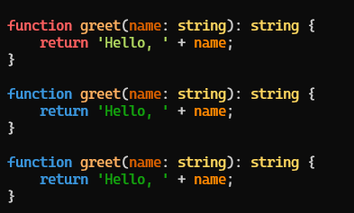
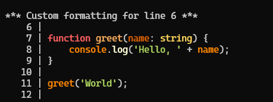
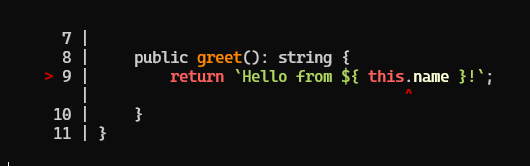

# xMap Description
`xMap` is a library designed to help with sourcemap parsing and TypeScript code formatting for the CLI.\
It includes components for parsing error stack traces, formatting code, and providing syntax highlighting, as well as a service for handling source maps.

# Installation
To install the package, use npm or yarn:
```bash
npm install @remotex-labs/xmap
```
or
```bash
yarn add @remotex-labs/xmap
```
# Usage SourceService
A TypeScript service for validating and processing source maps.
The `SourceService` class provides functionality for parsing and manipulating source maps, including retrieving position mappings, 
concatenating source maps, and getting code snippets based on mappings.

### Importing the SourceService
You can import the SourceService class in your TypeScript project as follows:
```typescript
import { SourceService } from '@remotex-labs/xmap'
```

## Creating an Instance of SourceService
You can create an instance of `SourceService` using either a `SourceMapInterface` object, 
a JSON string representing the source map, or an existing `SourceService` instance.
Example:
```typescript
import { SourceService } from '@remotex-labs/xmap';

const sourceMapJSON = `
{
  "version": 3,
  "sources": ["../src/core/core.component.ts", "../src/index.ts"],
  "sourceRoot": "https://github.com/remotex-lab/xmap/tree/test/",
  "sourcesContent": ["export class CoreModule {\\r\\n    private name: string;\\r\\n\\r\\n    constructor(name: string) {\\r\\n        this.name = name;\\r\\n    }\\r\\n\\r\\n    public greet(): string {\\r\\n        return \`Hello from \${ this.name }!\`;\\r\\n    }\\r\\n}", "import { CoreModule } from '@core/core.component';\\r\\n\\r\\nconst coreInstance = new CoreModule('Core Module');\\r\\n\\r\\nconsole.log(coreInstance.greet());"],
  "mappings": "aAAO,IAAMA,EAAN,KAAiB,CACZ,KAER,YAAYC,EAAc,CACtB,KAAK,KAAOA,CAChB,CAEO,OAAgB,CACnB,MAAO,cAAc,KAAK,IAAI,GAClC,CACJ,ECRA,IAAMC,EAAe,IAAIC,EAAW,aAAa,EAEjD,QAAQ,IAAID,EAAa,MAAM,CAAC",
  "names": ["CoreModule", "name", "coreInstance", "CoreModule"]
}
`;
const sourceService = new SourceService(sourceMapJSON, 'bundle.js');
console.log(sourceService);
```

## Retrieving Position Information
You can retrieve position information based on the original source line and column using the `getPositionByOriginal` method.
Example:
```typescript
const position = sourceService.getPositionByOriginal(3, 7, 'index.ts');
console.log(position);
```
## Getting Code Snippets
To retrieve the position and a code snippet from the original source based on the given generated code position, 
you can use the `getPositionWithCode` method.
Example:
```typescript
const positionWithCode = sourceService.getPositionWithCode(1, 104, Bias.UPPER_BOUND, { linesBefore: 2, linesAfter: 2 });
console.log(positionWithCode);
```

## Converting to JSON String
You can convert the current source map object to a JSON string using the `toString` method.
Example:
```typescript
console.log(sourceService.toString());
```

## Concatenating Source Maps
To concatenate one or more source maps to the current source map, you can use the `concat` method.
```typescript
const anotherSourceMap = {
    version: 3,
    file: "another-bundle.js",
    sources: ["bar.ts"],
    names: [],
    mappings: "AAAA"
};

sourceService.concat(anotherSourceMap);
console.log(sourceService.sources); // Updated source paths
```

## Parsing Error Stack Traces
The parseErrorStack function parses an error stack trace and returns an array of stack entries. 
Each entry contains information about the function call, file, line number, column number, 
and if applicable, details about the eval context.

### Example:
```typescript
import { parseErrorStack } from '@remotex-labs/xmap/parser.component';

// Example with Error object
try {
    throw new Error('Example error');
} catch (error) {
    // Parsing the stack trace from an Error object
    const parsedStack = parseErrorStack(error);
    console.log(parsedStack);
}
```

## highlightCode
Highlights the provided TypeScript code based on a specified highlighting scheme. 
This function creates a source file from the provided code string, walks through its nodes, 
and applies syntax highlighting according to the given schema.

Example:
```typescript
import { highlightCode } from '@remotex-labs/xmap/highlighter.component';

// TypeScript code to be highlighted
const codeToHighlight = `
function greet(name: string): string {
    return 'Hello, ' + name;
}
`;

// Optional custom highlight scheme
const customScheme = {
    keywordColor: '\x1b[36m', // Blue
    stringColor: '\x1b[32m',  // Green
    numberColor: '\x1b[31m'  // Red
};

// Highlight the code
const highlightedCode = highlightCode(codeToHighlight);
const highlightedCode2 = highlightCode(codeToHighlight, customScheme);
const highlightedCode3 = highlightCode(codeToHighlight);

// Output the highlighted code
console.log(highlightedCode, highlightedCode2, highlightedCode3);
```
> If you provide a customScheme, it will override the default highlighting scheme. This means you won't need to pass it each time you call highlightCode.


## formatCode
The `formatCode` function formats a given code snippet, adding line numbers with customizable padding and enabling specific actions for particular lines. 
This utility is useful for displaying code snippets in a user-friendly manner, particularly in documentation or debugging scenarios.

Example:
```typescript
import { formatCode } from '@remotex-labs/xmap/formatter.component';
import { highlightCode } from '@remotex-labs/xmap/highlighter.component';

const code = `
function greet(name: string) {
    console.log('Hello, ' + name);
}

greet('World');
`;

const formattedCode = formatCode(highlightCode(code), {
    padding: 8,
    startLine: 5,
    action: {
        triggerLine: 6,
        callback: (lineString, padding, lineNumber) => {
            return `*** Custom formatting for line ${lineNumber} ***\n${lineString}`;
        }
    }
});

console.log(formattedCode);
```


## formatErrorCode
The `formatErrorCode` function formats a code snippet around a specified error location, 
applying special highlighting to indicate where the error occurred. This function is particularly useful for debugging and error reporting, 
as it helps to visually identify issues in the source code.

```typescript
import { SourceService } from '@remotex-labs/xmap';
import { highlightCode } from '@remotex-labs/xmap/highlighter.component';
import { formatErrorCode } from '@remotex-labs/xmap/formatter.component';

const sourceMapJSON = `
{
  "version": 3,
  "sources": ["../src/core/core.component.ts", "../src/index.ts"],
  "sourceRoot": "https://github.com/remotex-lab/xmap/tree/test/",
  "sourcesContent": ["export class CoreModule {\\r\\n    private name: string;\\r\\n\\r\\n    constructor(name: string) {\\r\\n        this.name = name;\\r\\n    }\\r\\n\\r\\n    public greet(): string {\\r\\n        return \`Hello from \${ this.name }!\`;\\r\\n    }\\r\\n}", "import { CoreModule } from '@core/core.component';\\r\\n\\r\\nconst coreInstance = new CoreModule('Core Module');\\r\\n\\r\\nconsole.log(coreInstance.greet());"],
  "mappings": "aAAO,IAAMA,EAAN,KAAiB,CACZ,KAER,YAAYC,EAAc,CACtB,KAAK,KAAOA,CAChB,CAEO,OAAgB,CACnB,MAAO,cAAc,KAAK,IAAI,GAClC,CACJ,ECRA,IAAMC,EAAe,IAAIC,EAAW,aAAa,EAEjD,QAAQ,IAAID,EAAa,MAAM,CAAC",
  "names": ["CoreModule", "name", "coreInstance", "CoreModule"]
}
`;
const sourceService = new SourceService(sourceMapJSON, 'bundle.js');
const error = sourceService.getPositionWithCode(1, 91);

const ansiOption = {
    color: '\x1b[38;5;160m', // Color for error marker
    reset: '\x1b[0m'         // Reset color
};

if (error) {
    error.code = highlightCode(error.code);
    console.log(formatErrorCode(error, ansiOption));
}
```

